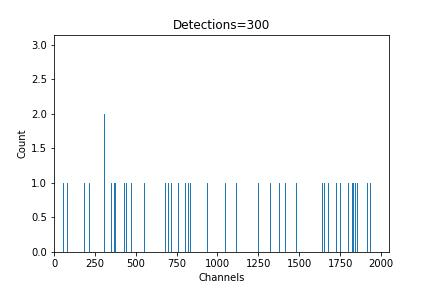
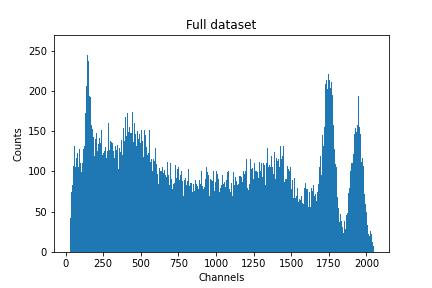
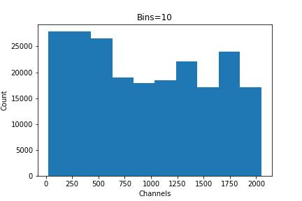

# Understanding Histograms
Before we get started, let's take a quick look at some of our data. Here we can see the first 10 values as recorded:
```
1.780899360489525179e+03
3.227395719771547533e+02
1.455079922763120805e+02
1.356769962678787806e+03
3.317730729724006551e+02
3.136292283517848887e+02
1.156268173200431875e+03
1.714656378754030186e+02
3.727997265676052621e+02
1.363714678853047189e+03
```
Just looking at this, it can be overwhelming to try and determine what is happening. The numbers appear to be random with no pattern in their appearance.

In this gamma spectroscopy data, each value corresponds to a given **photon energy** which is then put into one of 2048 **bins**. For a more complete explanation of the experiment and data collection methods, see the experiment section of our [data fitting lesson](https://det-lab.github.io/data-fitting/02_experiment_details/).

We can visualize how this data was collected by creating a gif showing how each new detection is stored as a new **count** (y-axis) in the **channels**/**bins** (x-axis).



In this gif, each new frame represents another 300 detection events. Over time, this eventually creates a visible pattern related to the radioactive element that was placed in the system. This is a **histogram** of our data. The total dataset (without reducing the number of **bins**) looks like:



 A **histogram** is a type of graph used to represent the distribution of numerical data, and is especially useful in cases such as this where the data is not continuous. Unlike a line or a bar graph where each value or category is plotted directly, a histogram groups data into ranges, called **bins**, and then counts how many data points fall into each range. In the above gif, the number of bins is the number of channels, making the data appear coarse and noisy. But the power of a histogram is in our ability to manipulate the number of bins to visualize our data. 

## Bins
**Bins** divide the range of x-values (channel numbers) into equal-width segments. Each bin groups all the data points that fall within its range and tallies how many there are, giving us a y-axis with units of counts. 

Choosing the right number of bins is a balance between **detail** and **readability**:

* More bins $\to$ More detail, higher resolution, but potentially noisier. This may help you resolve closely spaced peaks, but it can also amplify noise or fluctuations.

* Fewer bins $\to$ Smoother curve, but less resolution. This can help to clarify general trends and reduce noise, but it may blur out small but relevant peaks.



You will have to experiment with different bin settings depending on what it is that you want to analyze. Choosing the mathematically optimized number of bins can be incredibly complicated, but practically speaking it is normally effective to trust your eyes. It should look somewhat smooth but still contain notable features. 

Creating a histogram of our data allows us to identify patterns in large datasets such as:

* Where do the values concentrate?

* Are there clear peaks?

* Are there gaps or outliers?

* What's the range and shape of the data distribution? 

---

Now that we have a basic understanding of the features of histograms, [click here to continue to the next section](03_plotting_data.md) where we can learn the commands to create them.