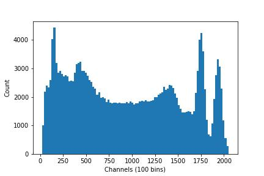
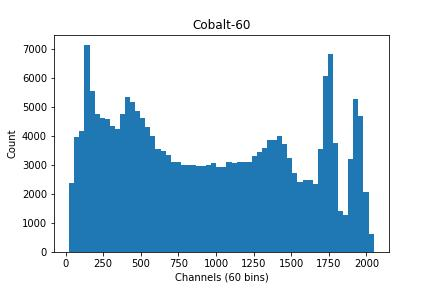

# Importing modules
In order to access data stored in our `.txt` file, you can use Python's `numpy` library to read the file before using `matplotlib` to create the histogram. This is a common workflow in data analysis for exploring the distribution of data. Let's get started by ensuring that you have these libraries installed.

In a Jupyter cell, it's possible to run terminal commands prefacing them with `!`, but you can also open a terminal from the `Home` page by selecting `New > Terminal` (near the top right of the screen):
```bash
pip install numpy
pip install matplotlib
```
After completing these installs, you'll have to make sure that the modules are imported at the start of your code. In your first cell, include the lines:
```bash
import matplotlib.pyplot as plt
import numpy as np
```

# Making the Histogram
Let's begin working to load in our data. One way to simplify this process if you're working with multiple similar files is to create a **method**. This allows us to load and plot any `.txt` files which follow the same format instead of repeating the steps for plotting the data for each file. 

Let's name our method `plot_histogram` and have it take a `filepath`, a number of `bins`, and a `title` as its inputs. Then, we can use `np.loadtxt()` to load our source file and assign it to a variable, allowing us to create our plot. By having our method take `bins` and `title` as arguments, this allows us to adjust the `bin` value or change the plot's title on future method calls while setting a default value for both. We can also have the graph state the number of bins we used along our x-axis and automatically save the file with our given title using `plt.savefig()`. If we use the `title` to generate the file name, then as long as that variable is adjusted the file's won't conflict. However, this may cause errors if the `title` field is left empty, or it may overwrite a previous version if the field is not changed.   

Putting this altogether gives us:
```python
def plot_histogram(filepath, bins=100, title=' '):
    data = np.loadtxt(filepath)
    # Create plot
    plt.hist(data, bins=bins)
    # Label axes
    plt.xlabel(f'Channels ({bins} bins)')
    plt.ylabel('Count')
    plt.title(f'{title}')
    # Save image
    plt.savefig(f'{title}.jpg')
    plt.show()
```
Now we can simply call our function and it will generate a plot for us with the specified title and number of bins. Let's try out a couple different options. First, let's try only passing the `filepath` as an argument. As `bins` and `title` are defined in the function call, it will leave those values as they are.
```python
plot_histogram('energies.txt')
```
**Output:**



Now we can try seeing what happens if we adjust the bin count and the title. Let's say that at 100 bins our graph looks a bit too noisy for our purposes, so we'll try a value of 60. We can say we know that the data was collected from a sample of Cobalt-60, so we can use that as our title. Let's try out:
```python
plot_histogram('energies.txt', bins=60, title='Cobalt-60')
```
**Output:**



With these examples, you can see how flexible a single plotting function can be. By changing just a couple arguments, you can adjust the look and labeling of your histogram to better suit your data and presentation needs. At this point, you've learned the essentials of reading in a dataset, building a reusable method, and generating clear plots that can be customized and saved for later use.

This has been a very bare-bones introduction to creating and using histogram plots, but there is much more to them than we are going over in this short lesson. If you're interested in learning more data analysis with this data set, we recommend you to take a look at our [data fitting lesson](https://det-lab.github.io/data-fitting/)

If you're interested in seeing another example of how to use histogram plots to visualize data, you can [follow this link to an HSF lesson](https://hsf-training.github.io/hsf-training-matplotlib/05-mplhep/index.html) detailing how the Higgs discovery was made using histogram plots.