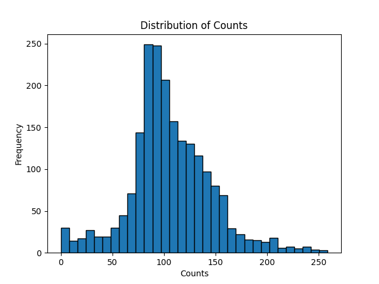
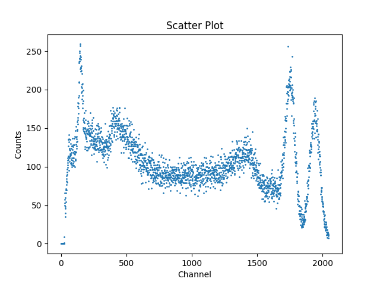

# Importing modules
In order to access data stored in a `.csv` file, you can use Python's `pandas` library to read the file before using `matplotlib` to create the histogram. This is a common workflow in data analysis for exploring the distribution of data. Let's get started by ensuring that you have these libraries installed.

In a Jupyter Notebook, it's possible to run terminal commands by prefacing a command with `!`, but you can also open a terminal at the bottom of the code workspace in VSCode by clicking the three dots at the right of the toolbar and selecting `Terminal > New Terminal`. Then, run the commands:
```bash
pip install pandas
pip install matplotlib
```
After completing these installs, you'll have to make sure that the modules are imported at the start of your code. In your first cell, include the lines:
```bash
import matplotlib.pyplot as plt
import pandas as pd
```
# Making the Histogram
Let's begin working to load in our data. One way to simplify this process is to create a **method** which can be used to load and plot any `.csv` files which follow the same format instead of repeating the steps for plotting the data for each file. Let's name our method `histogram_plot`.

The only argument `histogram_plot` will need to take will be the path to the `.csv` file. It can then be made to return a graph of the data. 

Let's also take a look at the file before we get started creating our method. Here's the first several lines of the file `Co60.csv` up until the actual data begins:


Of note here is that the actual graphable data taken by the software doesn't begin until row 23, with rows 1 to 21 showing the software settings that were used to take the data. Row 22 gives us the column names, **Channel**, **Energy**, and **Counts**. The Energy column is notably empty - data was only saved in the Channel and Counts columns. This means that when we begin plotting our data, we'll need to skip the first 21 rows and then also only use column 2. In `pandas`, this can be done with the `skiprows` and `usecols` keywords before assigning the data to a variable. 

`usecols` will also reformat the assigned variable so column `2` will become `0`. We can then use `plt.hist` to create a histogram with a chosen number of bins:
```python
def histogram_plot(filepath):
    # Load the data
    data = pd.read_csv(filepath, skiprows=21, usecols=[2])
    counts_data = data.iloc[:,0]
    col_name = data.columns[0]

    # Plot a histgram
    plt.hist(counts_data, bins=32, edgecolor='black')
    plt.xlabel(col_name)
    plt.ylabel("Frequency")
    plt.title("Distribution of " + col_name)
    plt.savefig("cobalt_hist.png")
    plt.show()
```
After defining `histogram_plot`, we can then call our method by passing any of our file paths as an argument:
```python
histogram_plot("radioactive-sources/Co60.csv")
```
Running this will then create the following plot:



## Interpretation
This plot has a large peak in the 75-100 count range. This means that many channels recorded ~75-100 gamma events, likely indicating this as a typical background or baseline rate.

This plot is also slightly skewed right. This means that fewer channels recorded higher counts than the mode of $\approx$ 75. This is to be expected with gamma spectroscopy as the isotope should be releasing fewer higher energy emissions. 

We can also observe multiple much smaller peaks (around the 0, 25, 200, and 250 counts), although without adjusting the bin count further it might be difficult to determine if these are signals or noise.
# Comparing to a Scatter Plot
Now, let's compare this with a scatter plot version of the same data. Let's first define our method:
```python
def scatter_plot(filepath):
    # Load the data
    data = pd.read_csv(filepath, skiprows=21, usecols=[0,2])
    x_axis = data.iloc[:,0]
    x_name = data.columns[0]

    y_axis = data.iloc[:,1]
    y_name = data.columns[1]
    
    # Create scatter plot
    plt.scatter(x_axis, y_axis, s=1)
    plt.xlabel(x_name)
    plt.ylabel(y_name)
    plt.title("Scatter Plot")
    plt.savefig("cobalt_scatter.png")
    plt.show()
```
We can then pass the same filepath as an argument:
```python
scatter_plot("radioactive-sources/Co60.csv")
```
Which should result in a graph like this one:


## Interpretation
The scatter plot visualizes how count data varies with channel number, showing the full shape of the emitted spectrum. Clear peaks, dips, and trends across 2048 channels. This allows for you to distinguish between narrow, sharp peaks (the characteristic gamma lines) and the broader humps (Compton scattering and background noise).

The dip between the ~900 and ~1300 channels likely corresponds to the histogram's mode as many values fall into that mid-count range, even though they're spread across many channels.

---

Now that we've explored how to visualize and interpret gamma spectroscopy data using two different types of plots, we've seen how these different methods of data visualization can provide us with different information from the same dataset. [Click here to continue to the conclusion.](05_conclusion.md)